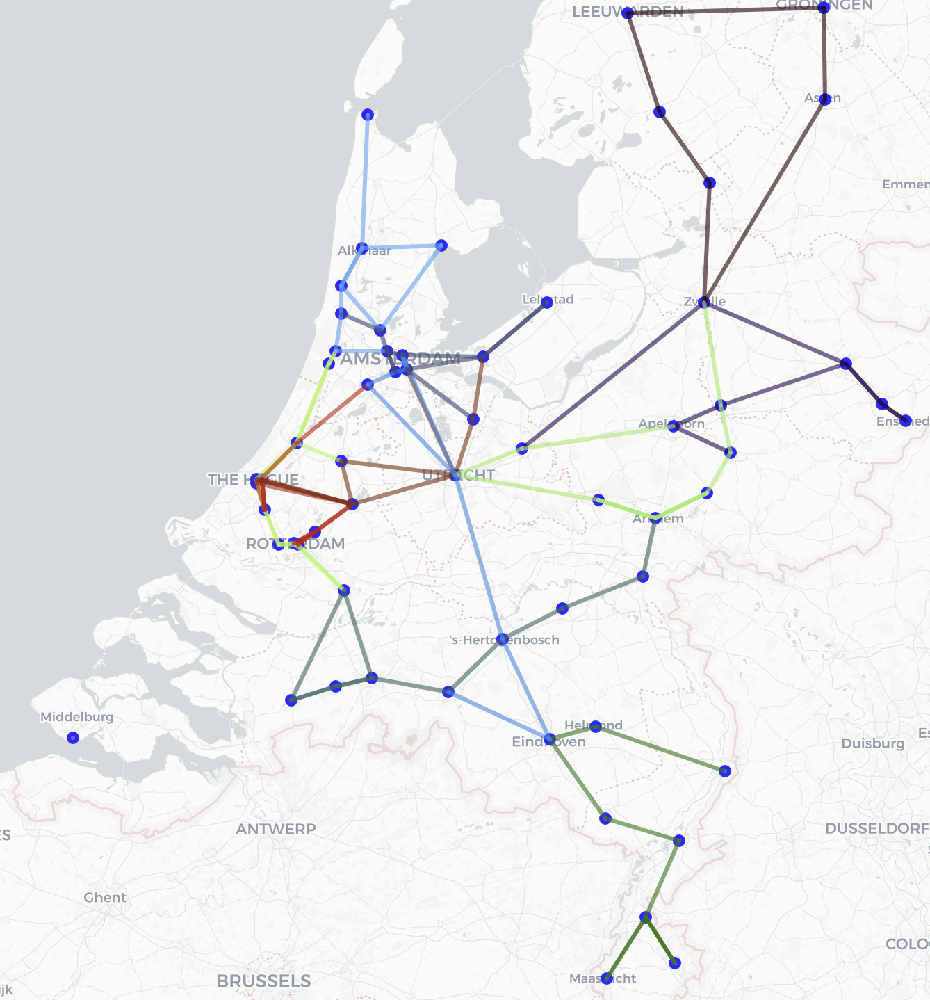

# BetterNS

<div align="center">
    
</div>

In de RailNL case moet er een dienstregeling worden gemaakt voor de intercity treinen in Nederland. De bedoeling van deze case is om een dienstregeling te maken voor Nederland waarbij er rekening moet worden gehouden met een aantal constraints. In heel Nederland mogen er niet meer dan 20 trajecten zijn en een traject mag niet een langere reistijd hebben dan 180 minuten. Het doel is om de score K zo hoog mogelijk te krijgen. De formule van de K is als volgt:

$$K = p * 10000 – (T * 100 + Min)​$$

Hierbij is p de fractie bereden verbindingen (tussen 0 en 1). T is het aantal trajecten en Min is de som van de reistijden van alle trajecten in minuten.

## Algoritmen

Er zijn vier verschillende algoritmes geïmplementeerd om de dienstregeling te optimaliseren.

### Random

De toepassing van een random algoritme op onze casus werkt als volgt. Er wordt ene leeg traject gemaakt. In dit traject wordt een random startstation gekozen. Vervolgens kiest het algoritme een random verbinding van dit station. Dit blijft hij doen totdat hij op de tijdslimiet van 180 minuten voor een traject zit. Vervolgens herhaalt dit proces zich 20 keer om zo een volledig random lijnvoering te krijgen.

### Random-Greedy

Een greedy algoritme zal altijd kiezen voor de kortste route. Als dit op de RailNL casus toegepast wordt, dan wordt nog steeds eerst een random startstation gekozen. Vervolgens wordt er een lijst gemaakt met alle verbindingen van dit station die nog geen enkele keer gereden zijn in de gehele lijnvoering. Vervolgens kiest het algoritme de kortste van deze verbindingen. Dit blijft hij wederom doen totdat hij 180 minuten rijdt. Dit proces herhaalt zich totdat er 20 trajecten zijn, of totdat alle verbindingen minimaal 1x gereden zijn.

### Hillclimber

Een Hillclimber algoritme is een iteratief algoritme. In ons geval worden 100.000 iteraties meegegeven. Ons Hillclimber algoritme start met het aannemen van een random gegenereerde lijnvoering. Bij iedere iteratie worden 1 tot 3 trajecten binnen de lijnvoering verwijderd Vervolgens wordt 1 traject minder toegevoegd. Als de score dan hoger is dan in de initiële situatie, blijft het hierbij. Mocht de score niet hoger zijn wordt er nog een laatste traject toegevoegd. Als deze stap klaar is wordt er weer gekeken of de nieuwe situatie beter is als de vorige. Zo ja: dan wordt de huidige situatie behouden. Zo niet: dan wordt de lijnvoering weer aangepast naar hoe deze was voor de aanpassingen binnen deze iteratie. Na 100.000 iteraties komt er dan een stuk betere lijnvoering uit dan in het begin. Bij het maken van een nieuw traject maakt het Hillclimber algoritme gebruik van een random traject, die gebruik maakt van heuristieken. De originele lijnvoering wordt gemaakt met volledig random trajecten, zonder heuristieken.

### Breadth First

Een breadth first algoritme is een constructief algoritme. Onze implementatie van het breadth first algoritme is als volgt. Eerst kiest het algoritme een random startstation. Vervolgens kijkt het algoritme naar alle connecties van dit station. Dan vraagt het algoritme het object op van de huidige connectie. Dit wordt herhaald tot het tijdslimiet van 180 minuten is bereikt. Welk traject in deze 180 minuten bij de meeste stations is geweest is dan het beste traject. Uit alle stations die niet zijn gebruikt in dit traject wordt vervolgens een random nieuwe startstation gekozen en wordt het breadth first algoritme nog een keer toegepast. Dit proces herhaalt zich totdat er 20 trajecten zijn.

## Aan de slag

### Vereisten

Deze code is geschreven in Python 3.12.3. In requirements.txt staan alle benodigde libraries die nodig zijn om de code te runnen.

Om deze libraries te installeren gebruik je de volgende command:

```bash
pip install -r requirements.txt
```

### Algemeen Gebruik

Om de code te kunnen runnen gebruik je de volgende algemene command:

```bash
python3 main.py <algorithm> <runs> 
```

Het invoeren van aantal runs is optioneel, standaard is het aantal runs 1.
Dus om bijvoorbeeld het random algoritme te runnen met 100 runs gebruik je de volgende command:

```bash
python3 main.py random 100 
```

Met uitzondering van het breadth first algoritme. Deze moet met aanhalings tekens worden getypt in de terminal. Dus om het breadth first algoritme te runnen met 10 iteraties gebruik je de volgende command:

```bash
python3 main.py "breadth first" 10
```

### Data

Wij hebben zelf al experimenten gedaan om de verschillende algoritmes te vergelijken. De data hiervan is opgeslagen. Met onderstaande link wordt je doorverwezen naar een Google Drive, waar je deze kan downloaden.

Link naar databestand: [output.csv](https://drive.google.com/file/d/1t7gX7bm0S-SrIda9_g1jyAehxsswfuCS/view?usp=drive_link)

Deze file moet opgeslagen worden met de naam output.csv in de map results. Mocht het nog niet helemaal duidelijk zijn, staat in de mappenstructuur die later te vinden is nog eens waar deze file opgeslagen wordt. Er kan ook gekozen worden om geen data te importeren en zelf data te genereren in een nieuw bestand. Als het bestand niet te vinden is in de results map, maakt hij automatisch een nieuwe file met de juiste kolomnamen en wordt de data vervolgens hierin gezet.

## Experimenten runnen

Om de experimenten te runnen gebruik je de volgende command:

```bash
commandos voor experimenten runnen
```

## Structuur

Onze mappen structuur ziet er als volgt uit:

```bash
. 
└── Better NS/ 
    ├── code/ 
    │   ├── algorythm/ 
    │   │   ├── breadth_first.py 
    │   │   ├── greedy.py 
    │   │   ├── hillclimber.py 
    │   │   └── randomise.py 
    │   ├── classes/ 
    │   │   ├── connections.py 
    │   │   ├── state.py 
    │   │   └── stations.py 
    │   ├── visualisation/ 
    │   │   ├── graphs.py 
    │   │   ├── plot.py 
    │   │   └── visualisation.py 
    │   └── save_load_data.py 
    ├── data/ 
    │   ├── ConnectiesHolland.csv 
    │   ├── ConnectiesNationaal.csv 
    │   ├── StationsHolland.csv 
    │   └── StationNationaal.csv 
    ├── results/ 
    │   ├── presentation/ 
    │   │   ├── images/ 
    │   │   └── presentation_betterns.pptx 
    │   ├── hillclimber_scores_output.csv 
    │   ├── Map_Netherlands.html 
    │   └── output.csv 
    ├── .gitignore 
    ├── main.py 
    ├── README.md 
    └── requirements.txt 
```

## Auteurs

BetterNS is gemaakt door:

- Nour Jamal
- Rick van Engelenburg
- Wassim Belloum
